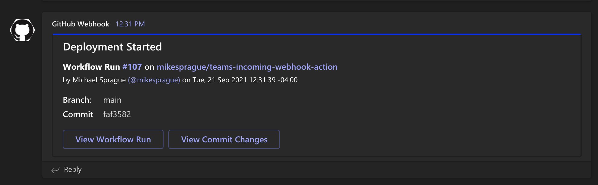

# teams-incoming-webhook-action

Sends a notification to an MS Teams Incoming Webhook from a GitHub Action Workflow

## Basic Usage

:construction: Docs in progress

This action requires a secret to be set up with your Teams Incoming Webhook URL named `MS_TEAMS_WEBHOOK_URL`

NOTE: see [official docs](https://docs.github.com/en/actions/reference/encrypted-secrets#creating-encrypted-secrets-for-a-repository) for adding secrets to your repo if neccessary

### Simple Notification

The following sends a simple notification with a title and message

```yaml
- name: Send simple notification
  uses: mikesprague/teams-incoming-webhook-action@v1
  with:
    github-token: ${{ github.token }}
    webhook-url: ${{ secrets.MS_TEAMS_WEBHOOK_URL }}
    title: "Notification Test"
    message: "This is an example of a simple notification with a title and a body"
```


### Deploy Status Notifications

The following examples show how to send notifications based on your workflow status

#### Info Notification

Include as first step in workflow to notify workflow run has started

```yaml
- name: Deploy Started Notification
  uses: mikesprague/teams-incoming-webhook-action@v1
  with:
    github-token: ${{ github.token }}
    webhook-url: ${{ secrets.MS_TEAMS_WEBHOOK_URL }}
    deploy-card: true
    title: "Deployment Started"
    color: "info"
```



#### Cancel Notification

Include anywhere in steps to notify workflow run has been cancelled

```yaml
- name: Cancelled Notification
  if: ${{ cancelled() }}
  uses: mikesprague/teams-incoming-webhook-action@v1
  with:
    github-token: ${{ github.token }}
    webhook-url: ${{ secrets.MS_TEAMS_WEBHOOK_URL }}
    deploy-card: true
    title: "Deployment Cancelled"
    color: "warning"
```


#### Failure Notification

Include anywhere in steps to notify when a workflow run fails

```yaml
- name: Failure Notification
  if: ${{ failure() }}
  uses: mikesprague/teams-incoming-webhook-action@v1
  with:
    github-token: ${{ github.token }}
    webhook-url: ${{ secrets.MS_TEAMS_WEBHOOK_URL }}
    deploy-card: true
    title: "Deployment Failed"
    color: "failure"
```


#### Success Message

Include anywhere in steps to notify when workflow run is successful

```yaml
- name: Success Notification
  if: ${{ success() }}
  uses: mikesprague/teams-incoming-webhook-action@v1
  with:
    github-token: ${{ github.token }}
    webhook-url: ${{ secrets.MS_TEAMS_WEBHOOK_URL }}
    deploy-card: true
    title: "Deployment Successful"
    color: "success"
```


